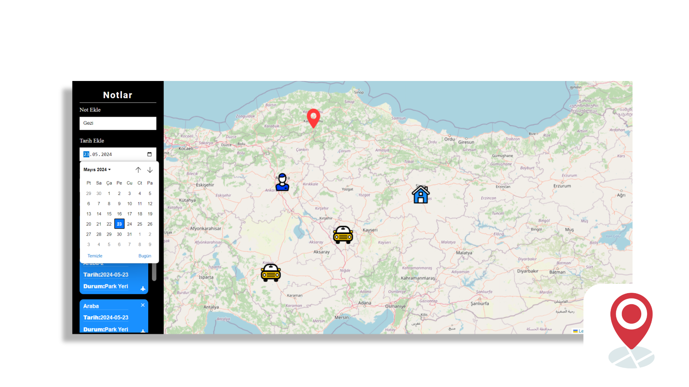
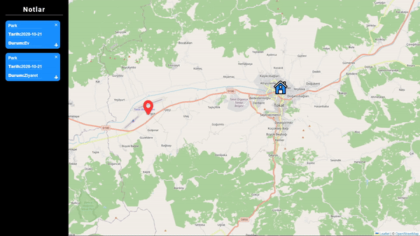
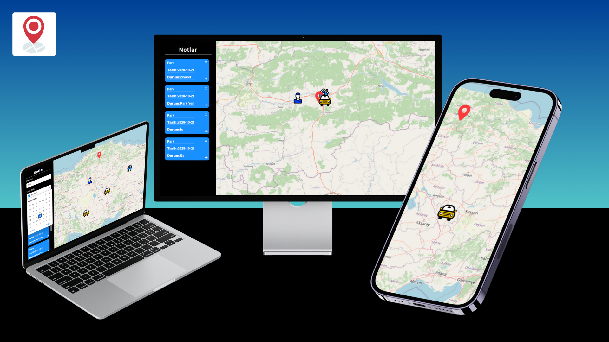

# Notlar Haritası Web Uygulaması



# [Web Sitesini Ziyaret Et](https://notlar-haritasi.netlify.app)

Bu proje, belirli konumları not alarak işaretleyebileceğiniz ve hızlı erişim sağlayabileceğiniz bir web uygulamasıdır. Uygulama, bir harita üzerinde çeşitli ikonlarla (Park, İş, Ev, Gezilecek Yerler) konum işaretlemeleri yapmanıza ve bu işaretlemelerle ilgili notlar almanıza olanak tanır.

## Özellikler

- **Side Alanı:** Sol tarafta not eklemeleri yapabileceğiniz bir alan bulunmaktadır. Bu alanda tarih ayarlayabilir ve notları ekleyip çıkarabilirsiniz.
- **Konum İşaretleme:** Harita üzerinde park yeri, iş, ev, gezilecek yerler gibi kategorilerde ikonlu işaretlemeler yapabilirsiniz.
- **Kısa Yollar:** Side alandaki notlar aracılığıyla işaretlediğiniz konumlara hızlıca gidebilirsiniz.

## Kullanım

1. **Not Ekleme:** Sol taraftaki "Notlar" alanına tıklayarak yeni bir not ekleyin. Notunuzu park, iş, ev veya gezilecek yerler kategorilerinden birine atayın.
2. **Tarih Ayarlama:** Not ekleme sırasında tarih bilgisi girebilirsiniz. Bu, notunuzu belirli bir tarihe bağlamanıza olanak tanır.
3. **Kısa Yollar:** Eklediğiniz notlara tıklayarak ilgili konuma hızlıca gidebilirsiniz.
4. **Not Silme:** İstediğiniz notu kaldırmak için notun sağ üst köşesindeki çarpı (x) butonuna tıklayın.

## Ekran Görüntüsü



## Gereksinimler

- Web tarayıcısı (Chrome, Firefox, Safari, vb.)
- Internet bağlantısı

## Kurulum ve Çalıştırma

1. Bu projeyi yerel makinenize klonlayın:
    ```sh
    git clone https://github.com/username/repository.git
    ```
2. Proje dizinine gidin:
    ```sh
    cd repository
    ```
3. `index.html` dosyasını bir web tarayıcısında açarak uygulamayı başlatın.





